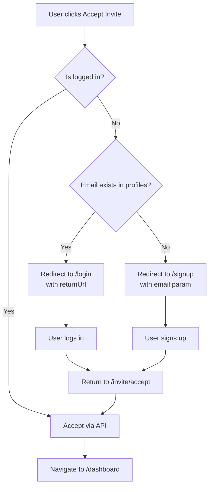

# Team Invite Flow

## Overview
LilPM supports inviting new or existing users to teams via email invitations.

## Flow Diagram



## Implementation

### AcceptInvitePage.tsx

```typescript
const acceptInvite = async () => {
  // CASE 1: User is logged in with valid session
  if (hasValidSession) {
    const team = await teamInviteService.acceptInvite(token);
    setOnboardingCompleted(true);
    navigate('/dashboard');
    return;
  }

  // CASE 2: Check if email exists in profiles
  const { data: existingProfile } = await supabase
    .from('profiles')
    .select('id')
    .eq('email', inviteEmail)
    .maybeSingle();

  if (existingProfile) {
    // Existing user - redirect to login
    navigate(`/login?returnUrl=${encodeURIComponent(returnUrl)}`);
  } else {
    // New user - redirect to signup with email
    navigate(`/signup?email=${encodeURIComponent(inviteEmail)}&returnUrl=${encodeURIComponent(returnUrl)}`);
  }
};
```

## URL Parameters

### /signup
| Param | Purpose |
|-------|---------|
| email | Pre-fill email field |
| returnUrl | Redirect after verification |

### /login
| Param | Purpose |
|-------|---------|
| returnUrl | Redirect after login |

## Database Tables

### team_invites
```sql
CREATE TABLE team_invites (
  id UUID PRIMARY KEY,
  team_id UUID REFERENCES teams(id),
  email TEXT NOT NULL,
  role TEXT DEFAULT 'member',
  invited_by UUID REFERENCES profiles(id),
  token TEXT UNIQUE NOT NULL,
  status TEXT DEFAULT 'pending',
  expires_at TIMESTAMPTZ,
  created_at TIMESTAMPTZ DEFAULT NOW()
);
```

## Status Values
| Status | Description |
|--------|-------------|
| pending | Waiting for user action |
| accepted | User joined the team |
| cancelled | Invite was revoked |
| expired | Past expiration date |

## Error Handling

### 403 Forbidden
- Cleared by removing corrupted localStorage tokens
- AuthStore handles this automatically

### Invalid Token
- Shows "Invite not found" message
- Suggests contacting team admin

## Edge Function: send-invite-email
Sends invitation emails with magic link.

```typescript
// supabase/functions/send-invite-email/index.ts
const inviteUrl = `${siteUrl}/invite/accept?token=${token}`;
```
