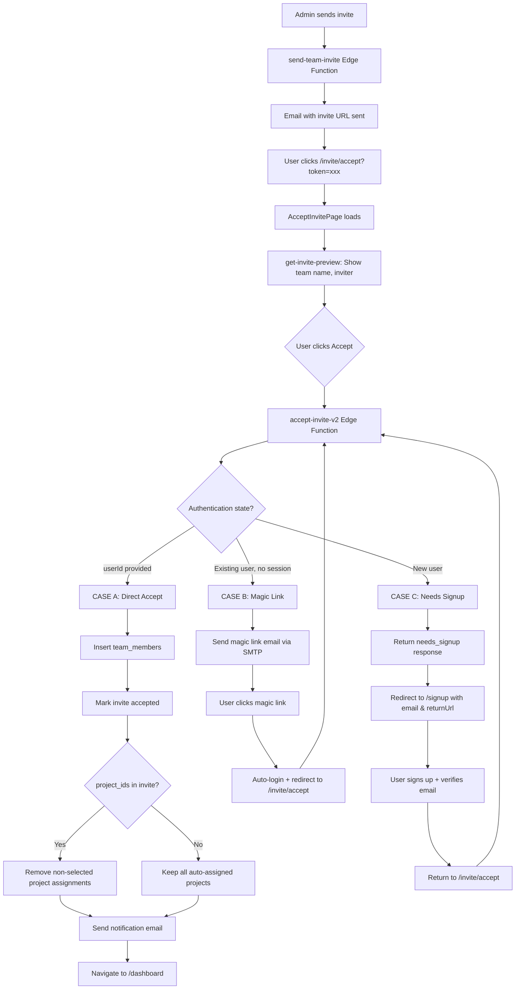

# Team Invite Flow

## Overview
LilPM supports inviting new or existing users to teams via email invitations. The system uses the `accept-invite-v2` Edge Function to handle three authentication scenarios.

## Flow Diagram



## AcceptInvitePage Implementation

**파일**: `src/pages/auth/AcceptInvitePage.tsx`

### Phase 1: Preview
```typescript
// get-invite-preview Edge Function 호출
const preview = await supabase.functions.invoke('get-invite-preview', {
  body: { token }
});
// 팀 이름, 초대자 이름/아바타, 상태 표시
```

### Phase 2: Accept/Decline
```typescript
const acceptInvite = async () => {
  if (!isAuthenticated) {
    // 로그인으로 리디렉트 (returnUrl 포함)
    navigate(`/login?returnUrl=${encodeURIComponent(`/invite/accept?token=${token}`)}`);
    return;
  }

  // accept-invite-v2 호출
  const result = await supabase.functions.invoke('accept-invite-v2', {
    body: { token, userId: user.id }
  });

  if (result.data.action === 'accepted') {
    setOnboardingCompleted(true);
    navigate('/dashboard');
  }
};
```

### 상태별 UI

| 상태 | 표시 내용 |
|------|----------|
| pending (유효) | 팀명, 초대자 + **수락/거절** 버튼 |
| cancelled | "Invitation Cancelled" 메시지 |
| expired | "Invitation Expired (24 hours)" 메시지 |
| accepted | "Already accepted" 메시지 |
| 에러 | "Invite not found" + 관리자 연락 안내 |

## accept-invite-v2 Edge Function

**파일**: `supabase/functions/accept-invite-v2/index.ts`
**버전**: `2026-02-10.2` (공유 모듈 리팩토링)
**공유 모듈**: `handleCors`, `env`, `createAdminClient`, `sendGmailEmail`, `versionedResponse`

> 리팩토링으로 508줄 → 355줄로 축소. 인라인 SMTP 코드를 `_shared/email.ts`의 `sendGmailEmail`으로 교체.

### Request/Response
```typescript
// Request
interface AcceptInviteRequest {
  token: string;
  userId?: string;  // 인증된 경우 제공
}

// Response
interface AcceptInviteResponse {
  success: boolean;
  action: 'accepted' | 'needs_auth' | 'needs_signup' | 'error';
  teamId?: string;
  teamName?: string;
  userExists?: boolean;
  email?: string;
  magicLinkSent?: boolean;
  error?: string;
  version: string;  // 예: "2026-02-10.2"
}
```

### 프로젝트별 초대 (2026-02-10)

`team_invites.project_ids` 컬럼을 통해 특정 프로젝트만 할당:

```typescript
// 초대 수락 후 project_ids 처리
if (invite.project_ids?.length > 0) {
  // auto_assign 트리거가 모든 프로젝트에 추가한 후
  // project_ids에 없는 프로젝트의 할당 제거
  const projectIdsToRemove = teamProjects
    .filter(id => !selectedSet.has(id));

  await supabaseAdmin
    .from('project_members')
    .delete()
    .eq('user_id', userId)
    .in('project_id', projectIdsToRemove);
}
```

## Database Tables

### team_invites
```sql
CREATE TABLE team_invites (
  id UUID PRIMARY KEY,
  team_id UUID REFERENCES teams(id),
  email TEXT NOT NULL,
  role TEXT DEFAULT 'member',
  invited_by UUID REFERENCES profiles(id),
  token TEXT UNIQUE NOT NULL,
  status TEXT DEFAULT 'pending',  -- pending, accepted, cancelled, expired
  project_ids UUID[] DEFAULT NULL, -- 선택적 프로젝트 할당
  expires_at TIMESTAMPTZ,          -- 24시간
  created_at TIMESTAMPTZ DEFAULT NOW()
);
```

## URL Parameters

### /invite/accept
| Param | Purpose |
|-------|---------|
| token | 초대 토큰 |

### /signup (초대 경유)
| Param | Purpose |
|-------|---------|
| email | 이메일 사전 입력 |
| returnUrl | 인증 후 리디렉트 |

### /login (초대 경유)
| Param | Purpose |
|-------|---------|
| returnUrl | 로그인 후 리디렉트 |

## Email Templates

### Magic Link Email
- `accept-invite-v2`에서 직접 생성
- Gmail SMTP (denomailer) 사용
- HTML 템플릿 (Lil PM 브랜딩)

### Invite Email
- `send-team-invite` Edge Function
- 팀 이름, 초대자 이름 포함
- 초대 수락 URL 링크

## Error Handling

| 에러 | 원인 | 해결 |
|------|------|------|
| 403 Forbidden | 손상된 localStorage 토큰 | authStore에서 자동 정리 |
| Invalid Token | 존재하지 않는 토큰 | "Invite not found" 표시 |
| Expired | 24시간 초과 | "Invitation Expired" 표시 |
| Already Member | 23505 에러 | 무시하고 진행 |

---

**관련 문서**
- [팀 멤버 관리](./team-members.md)
- [인증](./authentication.md)
- [프로젝트 멤버](./project-members.md)
